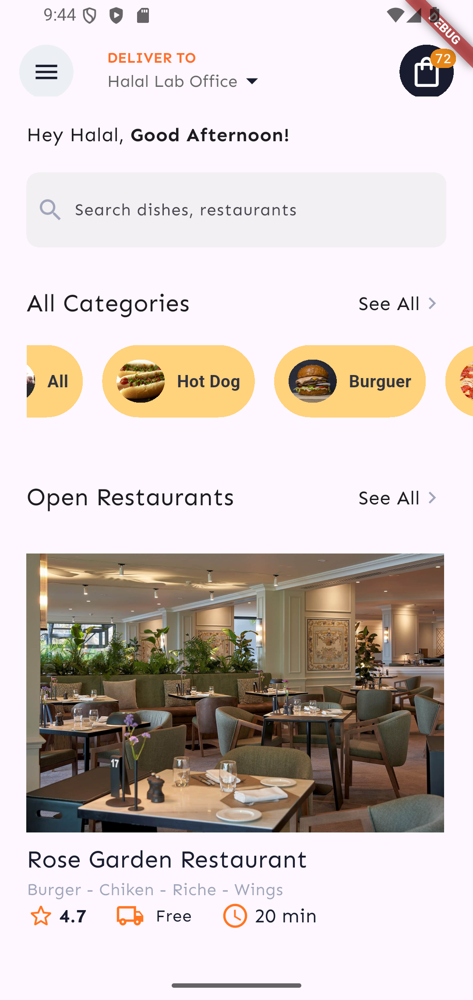
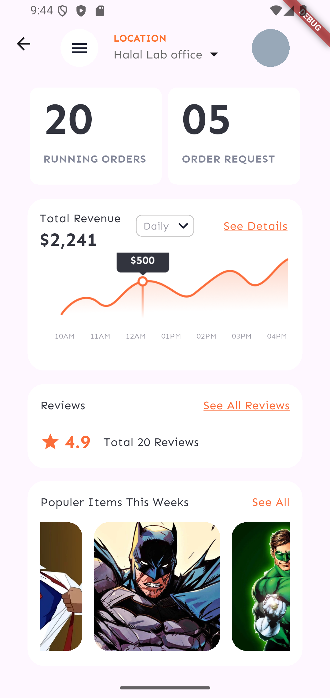
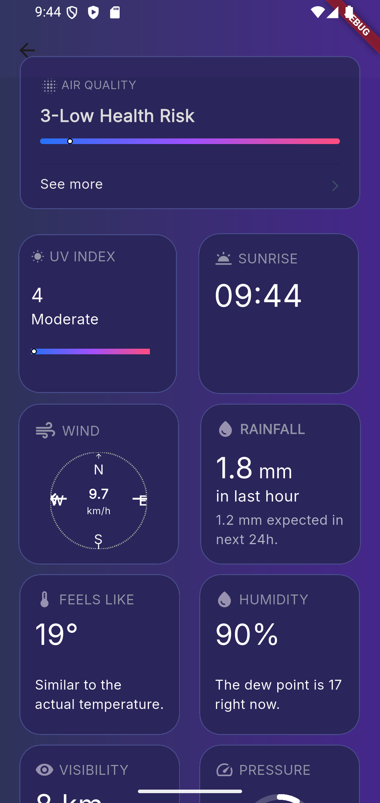

# 📱 Estudos Flutter - Primeiras Telas

Este é um projeto criado com o objetivo de praticar e aprender os fundamentos iniciais do **Flutter** e da linguagem **Dart**, focando principalmente no desenvolvimento de interfaces de usuário (**UI**).  
A proposta é explorar a **estruturação e estilização de componentes** visuais, como `Containers`, `Rows`, `Columns`, `Stacks`, `Text`, `Icons`, `Images`, entre outros.

---

## 🚀 Objetivo

- Praticar a criação de telas com layout responsivo.
- Utilizar **widgets básicos** e **composição de UI** no Flutter.
- Trabalhar com **estilização, alinhamento, fontes personalizadas e ícones**.
- Reutilização de componentes e construção de layouts modernos.

---

## 🛠️ Tecnologias Utilizadas

- **Flutter** 3.x
- **Dart**
- Editor: **Visual Studio Code**
- Gerenciador de pacotes: `pubspec.yaml`

---

## 📸 Imagens das Telas Desenvolvidas

As telas abaixo representam as primeiras interfaces desenvolvidas com foco em layout e estilização.

### 🔹 Página 1

### 🔹 Página 2

### 🔹 Página 3

### 🔹 Página 4

---

## 📚 Recursos Úteis para Iniciantes

- [✅ Lab oficial: Escreva seu primeiro app Flutter](https://docs.flutter.dev/get-started/codelab)
- [📘 Cookbook: Exemplos úteis em Flutter](https://docs.flutter.dev/cookbook)
- [📄 Documentação oficial Flutter](https://docs.flutter.dev/)

---

## ✨ Considerações Finais

Esse projeto faz parte de uma jornada inicial de aprendizado no universo Flutter. Novos recursos e técnicas mais avançadas serão adicionadas futuramente, como gerenciamento de estado, rotas, integração com APIs e uso de pacotes externos.

